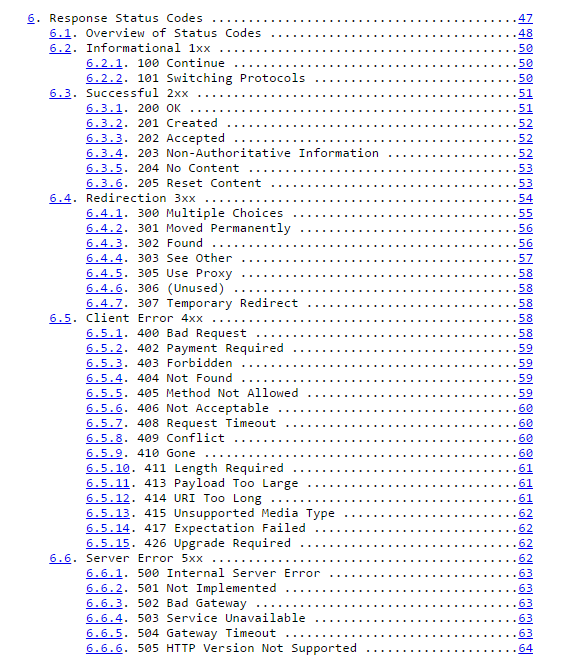

# Les headers

## Rappel 
Les headers figurent aussi bien dans la requete que dans la réponse du serveur :

## Utilité 
Dans les deux cas, les headers servent à véhiculer des informations utiles soient pour le serveur, soit pour le client.

### Header client
Exemple dans la requête ci dessous :

Si on analyse plus en détails les headers échangés :
* `GET /doc/test.html HTTP/1.1`  Page demandée et protocole de transmission 
* `Accept: image/gif, image/jpeg, */*` Le Navigateur accepte qu'on lui envoie des images jpeg ou gif, ou plus généralement n'importe quel contenu
* `Accept-Language: en-us` Le navigateur est configuré en Anglais, donc si possible, lui renvoyer du contenu traduit dans cette lange.
* `Accept-Encoding: gzip, deflate` le navigateur accepte qu'on compresse le contenu de la page web en utilisant gzip ou deflate pour gagner de la bande passante

### Header serveur

Il s'agit des headers qui vont le plus nous intéresser, car c'est ceux que nous allons gérer au quotidien dans l'application.
le plus important est le statut de la page : 

Malheureusement le plus connu :

Ci dessous la liste des statuts possibles. Ces status sont utiles, car savoir comment ils fonctionnent permet très souvent de se faire une idée du problème rencontré, simplement en regardant le status code.

Suivant : [LE MVC](../04-le-mvc/01-intro.md)
