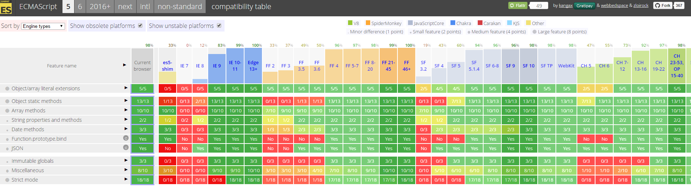

# Un peu d'histoire
## Les navigateurs, le [javascript][1] :


http://evolutionofweb.appspot.com/

Le javascript apparait aux alentours de 1994, mais au début il n'est que très peu présent et très peu supporté.
Il a longtemps été la source d'un conflit entre les différents navigateurs, chaque éditeur ayant sa propre version de Javascript, avec ses propres instruction et ses avantages et faiblesses.
Il faut attendre la cinquième version du standard ECMA (es5) pour que les choses se stabilisent et convergent enfin !
Nous sommes alors aux alentours de 2011 :



http://kangax.github.io/compat-table/es5/

## Le résultat :


Avant IE7 (pour rappel année 2006), pour un simple appel AJAX :
``` javascript
var xhttp;
if (window.XMLHttpRequest) {
    xhttp = new XMLHttpRequest();
    } else {
    // code for IE6, IE5
    xhttp = new ActiveXObject("Microsoft.XMLHTTP");
}
// 6 lignes, toujours pas de requête....
```
Il fallait créer un activeX pour pouvoir gérér cet appel. Comme les PC avec IE6 n'ont pas disparus instantanément à la sortie de IE7, cela signifie concrètement que pendant les années suivantes, il fallait encore gérer cette distinction !
Pour un développeur, supporter la panoplie des différents navigateurs en service relevait de la gageure !

## LA caractéristique principale.
Ou ce qu'il faut savoir pour comprendre comment fonctionne le JS:

source : https://developer.mozilla.org/en-US/docs/Tools/Performance/Scenarios/Intensive_JavaScript
>By default the browser uses a single thread to run all the JavaScript in your page as well as to perform layout, reflows, and garbage collection. This means that long-running JavaScript functions can block the thread, leading to an unresponsive page and a bad user experience.

**ATTENTION : demarrez un nouveau navigateur, car ce test va le planter !**

Démonstration : https://jsfiddle.net/c5esk9zp/1/

## Conséquence sur le code :
Tout le code JS organiser de façon à ne pas bloquer le navigateur : Les actions potentiellement longues que l'on doit enchainer utilisent en interne la notion de callback pour déclencher l'évenement suivant.
Cela donne parfois lieu à la fameuse "pyramid of doom" :


Suite [le monde avant Chrome et ES5](./02-le-js-avant-ECMAScript5.md)

[1]:https://en.wikipedia.org/wiki/JavaScript